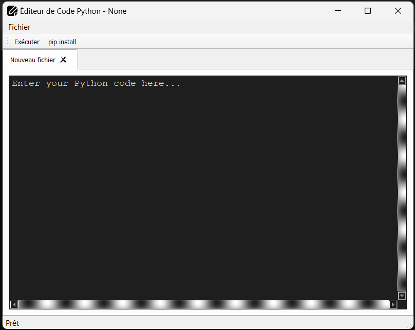

# PyEditor - Éditeur de Code Python

PyEditor est un éditeur de code Python simple et personnalisable avec une interface utilisateur conviviale.

## Fonctionnalités

- Éditeur de code Python intégré avec coloration syntaxique.
- Prise en charge de l'ouverture, de la modification et de l'enregistrement de fichiers Python.
- Exécution de code Python à partir de l'éditeur.
- Installation de modules Python à partir de l'éditeur.
- Interface utilisateur moderne et agréable.

## Prérequis

1. [Python 3.x](https://www.python.org/downloads/)
2. [PyQt5](https://pypi.org/project/PyQt5/) ⚠️ (Pas besoin si vous installez le zip contenant le .exe)

## Installation

Voir les "releases".
